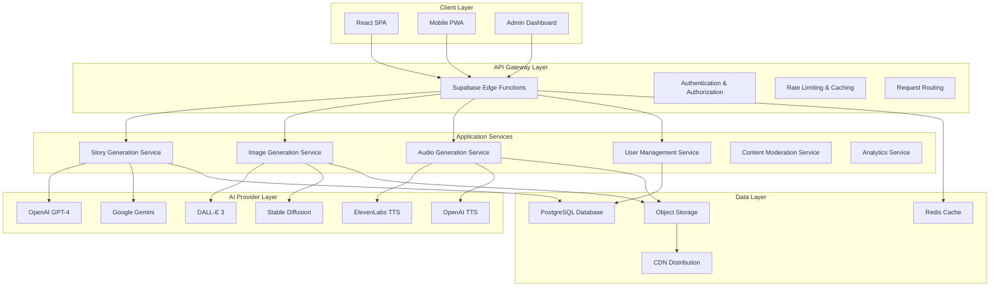

# TaleForge: Technical Specification Document
## AI-Powered Interactive Storytelling Platform

**Version:** 2.0  
**Date:** July 11, 2025  
**Document Type:** Technical Architecture & Implementation Guide  
**Classification:** Internal Development & Technical Due Diligence

---

## Table of Contents
1. [System Architecture Overview](#system-architecture-overview)
2. [Technology Stack](#technology-stack)
3. [AI Integration Layer](#ai-integration-layer)
4. [Database Design](#database-design)
5. [API Specifications](#api-specifications)
6. [Security & Compliance](#security--compliance)
7. [Performance & Scalability](#performance--scalability)
8. [Deployment & Infrastructure](#deployment--infrastructure)
9. [Development Workflow](#development-workflow)
10. [Quality Assurance](#quality-assurance)

---

## System Architecture Overview

### **High-Level Architecture**



### **Microservices Architecture**

#### **Core Services**
1. **Story Generation Service**: Orchestrates AI text generation with context management
2. **Image Generation Service**: Handles visual content creation with style consistency
3. **Audio Generation Service**: Manages voice synthesis and audio processing
4. **User Management Service**: Authentication, profiles, and preferences
5. **Content Moderation Service**: Safety checks and quality assurance
6. **Analytics Service**: User behavior tracking and performance metrics

#### **Service Communication**
- **Synchronous**: HTTP/REST for real-time user interactions
- **Asynchronous**: Event-driven architecture for background processing
- **Message Queue**: Redis for job processing and service coordination
- **Real-time**: WebSocket connections for live updates

### **Data Flow Architecture**

```typescript
interface StoryGenerationFlow {
  userRequest: {
    prompt: string;
    preferences: UserPreferences;
    context: StoryContext;
  };
  
  aiOrchestration: {
    textGeneration: Promise<StorySegment>;
    imageGeneration: Promise<ImageAsset>;
    audioGeneration: Promise<AudioAsset>;
  };
  
  contentProcessing: {
    moderation: ContentSafety;
    optimization: PerformanceMetrics;
    storage: AssetManagement;
  };
  
  userDelivery: {
    realTimeResponse: StoryResponse;
    caching: CDNDistribution;
    analytics: UserEngagement;
  };
}
```

---

## Technology Stack

### **Frontend Technologies**

#### **Core Framework**
```json
{
  "framework": "React 18.2.0",
  "language": "TypeScript 5.2.0",
  "buildTool": "Vite 5.0.0",
  "stateManagement": "Zustand 4.4.0",
  "dataFetching": "TanStack Query 5.0.0"
}
```

#### **UI/UX Libraries**
```json
{
  "styling": "Tailwind CSS 3.4.0",
  "components": "Shadcn/UI",
  "animations": "Framer Motion 10.16.0",
  "icons": "Lucide React 0.300.0",
  "forms": "React Hook Form 7.48.0"
}
```

#### **PWA & Performance**
```json
{
  "pwa": "Vite PWA Plugin",
  "bundleAnalysis": "Bundle Analyzer",
  "codesplitting": "React Lazy + Suspense",
  "prefetching": "React Query Prefetch",
  "compression": "Gzip + Brotli"
}
```

### **Backend Infrastructure**

#### **Primary Stack**
```json
{
  "platform": "Supabase",
  "database": "PostgreSQL 15.0",
  "runtime": "Deno Edge Runtime",
  "functions": "Supabase Edge Functions",
  "authentication": "Supabase Auth + RLS"
}
```

#### **AI Integration**
```json
{
  "textGeneration": {
    "primary": "OpenAI GPT-4.1-2025",
    "fallback": "Google Gemini Pro",
    "customModels": "Fine-tuned narrative models"
  },
  "imageGeneration": {
    "primary": "DALL-E 3",
    "fallback": "Stable Diffusion XL",
    "enhancement": "Real-time style transfer"
  },
  "audioGeneration": {
    "voiceSynthesis": "ElevenLabs + OpenAI TTS",
    "processing": "Web Audio API",
    "compression": "Opus codec"
  }
}
```

### **DevOps & Infrastructure**

#### **Development Tools**
```json
{
  "versionControl": "Git with GitHub",
  "cicd": "GitHub Actions",
  "testing": "Vitest + React Testing Library",
  "linting": "ESLint + Prettier",
  "typeChecking": "TypeScript strict mode"
}
```

#### **Monitoring & Analytics**
```json
{
  "errorTracking": "Sentry",
  "analytics": "Supabase Analytics + Custom Events",
  "performance": "Web Vitals + Lighthouse CI",
  "uptime": "Pingdom + StatusPage",
  "logs": "Supabase Logs + CloudWatch"
}
```

---

## AI Integration Layer

### **AI Provider Management**

#### **Multi-Provider Architecture**
```typescript
interface AIProviderConfig {
  providers: {
    textGeneration: {
      primary: OpenAIProvider;
      fallback: GeminiProvider;
      customModels: FineTunedModels[];
    };
    imageGeneration: {
      primary: DALLEProvider;
      fallback: StableDiffusionProvider;
      enhancement: StyleTransferService;
    };
    audioGeneration: {
      primary: ElevenLabsProvider;
      fallback: OpenAITTSProvider;
      processing: AudioProcessingService;
    };
  };
  
  failoverStrategy: {
    maxRetries: 3;
    timeoutMs: 30000;
    healthCheckInterval: 60000;
    circuitBreakerThreshold: 5;
  };
  
  loadBalancing: {
    algorithm: "round-robin";
    healthWeighting: true;
    costOptimization: true;
  };
}
```

#### **Context Management**
```typescript
interface StoryContext {
  narrative: {
    previousSegments: StorySegment[];
    characters: CharacterProfile[];
    worldBuilding: WorldContext;
    plotState: PlotProgress;
  };
  
  visual: {
    artStyle: ArtStyle;
    characterConsistency: CharacterAppearance[];
    settingContinuity: EnvironmentDetails;
    colorPalette: ColorScheme;
  };
  
  audio: {
    narratorVoice: VoiceProfile;
    musicStyle: AudioTheme;
    soundEffects: SFXPreferences;
    pacing: AudioTiming;
  };
  
  user: {
    preferences: PersonalizationSettings;
    ageAppropriate: ContentFilters;
    learningObjectives: EducationalGoals;
    progressTracking: UserProgress;
  };
}
```

### **AI Orchestration Engine**

#### **Generation Coordination**
```typescript
class AIOrchestrationEngine {
  async generateStorySegment(
    prompt: string,
    context: StoryContext,
    preferences: UserPreferences
  ): Promise<StorySegment> {
    // Parallel generation with dependency management
    const [textResult, imagePrompt] = await Promise.all([
      this.generateText(prompt, context),
      this.createImagePrompt(prompt, context)
    ]);
    
    const [imageResult, audioResult] = await Promise.all([
      this.generateImage(imagePrompt, context.visual),
      this.generateAudio(textResult.text, context.audio)
    ]);
    
    return {
      id: generateId(),
      text: textResult.text,
      choices: textResult.choices,
      imageUrl: imageResult.url,
      audioUrl: audioResult.url,
      metadata: {
        generationTime: performance.now() - startTime,
        aiProviders: {
          text: textResult.provider,
          image: imageResult.provider,
          audio: audioResult.provider
        },
        qualityScores: {
          text: textResult.qualityScore,
          image: imageResult.qualityScore,
          audio: audioResult.qualityScore
        }
      }
    };
  }
  
  private async generateText(
    prompt: string,
    context: StoryContext
  ): Promise<TextGenerationResult> {
    const provider = await this.selectBestTextProvider();
    
    try {
      return await provider.generate({
        prompt: this.buildEnhancedPrompt(prompt, context),
        temperature: 0.7,
        maxTokens: 500,
        contextWindow: context.narrative.previousSegments
      });
    } catch (error) {
      // Automatic failover to backup provider
      const fallbackProvider = this.getFallbackTextProvider();
      return await fallbackProvider.generate({
        prompt: this.buildEnhancedPrompt(prompt, context),
        temperature: 0.7,
        maxTokens: 500
      });
    }
  }
}
```

### **Quality Assurance Pipeline**

#### **Content Moderation**
```typescript
interface ContentModerationPipeline {
  aiSafetyChecks: {
    toxicity: ToxicityDetection;
    appropriateness: AgeAppropriateFilter;
    accuracy: FactualVerification;
    bias: BiasDetection;
  };
  
  humanOversight: {
    randomSampling: QualitySpotCheck;
    flaggedContent: HumanReview;
    feedbackLoop: ModelImprovement;
  };
  
  userFeedback: {
    ratingSystem: ContentRating;
    reportingMechanism: UserReports;
    communityModeration: PeerReview;
  };
}
```

#### **Performance Monitoring**
```typescript
interface AIPerformanceMetrics {
  generationSpeed: {
    textGeneration: ResponseTime;
    imageGeneration: ResponseTime;
    audioGeneration: ResponseTime;
    totalPipelineTime: ResponseTime;
  };
  
  qualityMetrics: {
    userSatisfaction: UserRating;
    narrativeCoherence: CoherenceScore;
    visualConsistency: ConsistencyScore;
    audioSynchronization: TimingAccuracy;
  };
  
  reliabilityMetrics: {
    successRate: GenerationSuccessRate;
    errorRate: ErrorAnalytics;
    failoverFrequency: FailoverMetrics;
    uptime: ServiceAvailability;
  };
}
```

---

## Database Design

### **Entity Relationship Diagram**

```sql
-- Core Entity Schema
CREATE TABLE users (
  id UUID PRIMARY KEY DEFAULT gen_random_uuid(),
  email TEXT UNIQUE NOT NULL,
  full_name TEXT,
  avatar_url TEXT,
  subscription_tier TEXT DEFAULT 'free',
  preferences JSONB DEFAULT '{}',
  created_at TIMESTAMP WITH TIME ZONE DEFAULT NOW(),
  updated_at TIMESTAMP WITH TIME ZONE DEFAULT NOW()
);

CREATE TABLE stories (
  id UUID PRIMARY KEY DEFAULT gen_random_uuid(),
  user_id UUID REFERENCES users(id) ON DELETE CASCADE,
  title TEXT NOT NULL,
  description TEXT,
  story_mode TEXT NOT NULL,
  genre TEXT NOT NULL,
  target_age INTEGER,
  is_completed BOOLEAN DEFAULT FALSE,
  is_public BOOLEAN DEFAULT FALSE,
  metadata JSONB DEFAULT '{}',
  created_at TIMESTAMP WITH TIME ZONE DEFAULT NOW(),
  updated_at TIMESTAMP WITH TIME ZONE DEFAULT NOW()
);

CREATE TABLE story_segments (
  id UUID PRIMARY KEY DEFAULT gen_random_uuid(),
  story_id UUID REFERENCES stories(id) ON DELETE CASCADE,
  parent_segment_id UUID REFERENCES story_segments(id),
  segment_text TEXT NOT NULL,
  choices TEXT[] DEFAULT '{}',
  is_end BOOLEAN DEFAULT FALSE,
  order_index INTEGER NOT NULL,
  
  -- Media Assets
  image_url TEXT,
  image_generation_status TEXT DEFAULT 'pending',
  audio_url TEXT,
  audio_generation_status TEXT DEFAULT 'pending',
  
  -- Metadata
  word_count INTEGER,
  generation_time_ms INTEGER,
  ai_providers JSONB DEFAULT '{}',
  quality_scores JSONB DEFAULT '{}',
  
  -- Triggering Information
  triggering_choice_text TEXT,
  
  created_at TIMESTAMP WITH TIME ZONE DEFAULT NOW(),
  updated_at TIMESTAMP WITH TIME ZONE DEFAULT NOW()
);

CREATE TABLE user_interactions (
  id UUID PRIMARY KEY DEFAULT gen_random_uuid(),
  user_id UUID REFERENCES users(id) ON DELETE CASCADE,
  story_id UUID REFERENCES stories(id) ON DELETE CASCADE,
  segment_id UUID REFERENCES story_segments(id) ON DELETE CASCADE,
  interaction_type TEXT NOT NULL, -- 'choice_selected', 'segment_completed', 'story_rated'
  interaction_data JSONB DEFAULT '{}',
  created_at TIMESTAMP WITH TIME ZONE DEFAULT NOW()
);

CREATE TABLE content_analytics (
  id UUID PRIMARY KEY DEFAULT gen_random_uuid(),
  story_id UUID REFERENCES stories(id) ON DELETE CASCADE,
  segment_id UUID REFERENCES story_segments(id) ON DELETE CASCADE,
  metrics JSONB NOT NULL,
  date_recorded DATE DEFAULT CURRENT_DATE,
  created_at TIMESTAMP WITH TIME ZONE DEFAULT NOW()
);
```

### **Indexing Strategy**

#### **Performance Indexes**
```sql
-- User story access patterns
CREATE INDEX idx_stories_user_id ON stories(user_id);
CREATE INDEX idx_stories_public ON stories(is_public) WHERE is_public = true;
CREATE INDEX idx_stories_completed ON stories(is_completed, created_at);

-- Story segment relationships
CREATE INDEX idx_story_segments_story_id ON story_segments(story_id, order_index);
CREATE INDEX idx_story_segments_parent ON story_segments(parent_segment_id);
CREATE INDEX idx_story_segments_generation_status ON story_segments(image_generation_status, audio_generation_status);

-- Analytics and reporting
CREATE INDEX idx_user_interactions_user_story ON user_interactions(user_id, story_id, created_at);
CREATE INDEX idx_content_analytics_date ON content_analytics(date_recorded);

-- Full-text search
CREATE INDEX idx_stories_search ON stories USING gin(to_tsvector('english', title || ' ' || description));
CREATE INDEX idx_segments_search ON story_segments USING gin(to_tsvector('english', segment_text));
```

#### **Partitioning Strategy**
```sql
-- Partition large tables by date for performance
CREATE TABLE user_interactions_2025 PARTITION OF user_interactions
FOR VALUES FROM ('2025-01-01') TO ('2026-01-01');

CREATE TABLE user_interactions_2026 PARTITION OF user_interactions
FOR VALUES FROM ('2026-01-01') TO ('2027-01-01');

-- Partition analytics by month for efficient querying
CREATE TABLE content_analytics_202507 PARTITION OF content_analytics
FOR VALUES FROM ('2025-07-01') TO ('2025-08-01');
```

### **Data Migration & Versioning**

#### **Schema Migration System**
```sql
-- Migration tracking
CREATE TABLE schema_migrations (
  version TEXT PRIMARY KEY,
  description TEXT NOT NULL,
  applied_at TIMESTAMP WITH TIME ZONE DEFAULT NOW()
);

-- Example migration: Add user preferences
INSERT INTO schema_migrations (version, description) VALUES 
('20250711001', 'Add advanced user preferences and AI settings');

ALTER TABLE users ADD COLUMN ai_preferences JSONB DEFAULT '{}';
UPDATE users SET ai_preferences = '{"narrativeStyle": "balanced", "imageStyle": "realistic", "voicePreference": "natural"}';
```

#### **Data Backup Strategy**
```sql
-- Automated backups with point-in-time recovery
-- Daily full backups with 30-day retention
-- Hourly incremental backups with 7-day retention
-- Real-time replication to secondary regions

-- Backup verification queries
SELECT 
  schemaname,
  tablename,
  pg_size_pretty(pg_total_relation_size(schemaname||'.'||tablename)) as size
FROM pg_tables 
WHERE schemaname = 'public'
ORDER BY pg_total_relation_size(schemaname||'.'||tablename) DESC;
```

---

## API Specifications

### **RESTful API Design**

#### **Core API Endpoints**
```typescript
interface TaleForgeAPI {
  // Authentication & User Management
  'POST /auth/login': LoginRequest => AuthResponse;
  'POST /auth/logout': void => void;
  'GET /auth/user': void => UserProfile;
  'PUT /auth/user': UpdateUserRequest => UserProfile;
  
  // Story Management
  'POST /api/stories': CreateStoryRequest => Story;
  'GET /api/stories': PaginationQuery => StoriesResponse;
  'GET /api/stories/:id': void => StoryResponse;
  'PUT /api/stories/:id': UpdateStoryRequest => Story;
  'DELETE /api/stories/:id': void => void;
  'POST /api/stories/:id/complete': void => Story;
  
  // Story Generation
  'POST /api/generate/story-segment': GenerationRequest => StorySegment;
  'POST /api/generate/image': ImageGenerationRequest => ImageResponse;
  'POST /api/generate/audio': AudioGenerationRequest => AudioResponse;
  'GET /api/generate/status/:jobId': void => GenerationStatus;
  
  // User Interactions
  'POST /api/interactions': InteractionRequest => void;
  'GET /api/users/:id/analytics': AnalyticsQuery => UserAnalytics;
  
  // Content Management
  'GET /api/content/featured': void => FeaturedContent;
  'POST /api/content/report': ContentReportRequest => void;
  'GET /api/content/search': SearchQuery => SearchResults;
}
```

#### **Request/Response Schemas**
```typescript
// Story Generation Request
interface GenerationRequest {
  storyId?: string;
  prompt: string;
  parentSegmentId?: string;
  choiceText?: string;
  preferences: {
    genre: string;
    ageRange: string;
    narrativeStyle: 'descriptive' | 'action-packed' | 'dialogue-heavy';
    imageStyle: 'realistic' | 'cartoon' | 'artistic';
    voiceStyle: 'natural' | 'dramatic' | 'educational';
  };
  generateImage: boolean;
  generateAudio: boolean;
}

// Story Segment Response
interface StorySegment {
  id: string;
  storyId: string;
  parentSegmentId?: string;
  text: string;
  choices: string[];
  isEnd: boolean;
  orderIndex: number;
  
  // Media assets
  imageUrl?: string;
  imageGenerationStatus: 'pending' | 'in_progress' | 'completed' | 'failed';
  audioUrl?: string;
  audioGenerationStatus: 'pending' | 'in_progress' | 'completed' | 'failed';
  
  // Metadata
  wordCount: number;
  generationTimeMs: number;
  aiProviders: {
    text: string;
    image?: string;
    audio?: string;
  };
  qualityScores: {
    text: number;
    image?: number;
    audio?: number;
  };
  
  createdAt: string;
  updatedAt: string;
}
```

### **Real-time API (WebSocket)**

#### **WebSocket Event System**
```typescript
interface WebSocketEvents {
  // Client to Server
  'story:generate': GenerationRequest;
  'story:choice': ChoiceSelection;
  'story:complete': StoryCompletion;
  
  // Server to Client
  'generation:started': GenerationStarted;
  'generation:progress': GenerationProgress;
  'generation:completed': GenerationCompleted;
  'generation:error': GenerationError;
  
  // Real-time collaboration
  'user:joined': UserJoined;
  'user:left': UserLeft;
  'story:updated': StoryUpdated;
}

// WebSocket message format
interface WebSocketMessage<T = any> {
  event: keyof WebSocketEvents;
  data: T;
  timestamp: string;
  requestId?: string;
}
```

### **GraphQL API (Future)**

#### **Schema Definition**
```graphql
type User {
  id: ID!
  email: String!
  fullName: String
  subscriptionTier: SubscriptionTier!
  preferences: UserPreferences!
  stories: [Story!]!
  createdAt: DateTime!
}

type Story {
  id: ID!
  title: String!
  description: String
  genre: Genre!
  isCompleted: Boolean!
  segments: [StorySegment!]!
  analytics: StoryAnalytics
  createdAt: DateTime!
  updatedAt: DateTime!
}

type StorySegment {
  id: ID!
  text: String!
  choices: [String!]!
  isEnd: Boolean!
  imageUrl: String
  audioUrl: String
  parent: StorySegment
  children: [StorySegment!]!
  createdAt: DateTime!
}

type Query {
  user(id: ID!): User
  story(id: ID!): Story
  stories(filter: StoryFilter, pagination: Pagination): StoryConnection!
  featuredStories: [Story!]!
}

type Mutation {
  createStory(input: CreateStoryInput!): Story!
  generateSegment(input: GenerationInput!): StorySegment!
  completeStory(storyId: ID!): Story!
  updateUserPreferences(input: UserPreferencesInput!): User!
}

type Subscription {
  storyGeneration(storyId: ID!): GenerationUpdate!
  userActivity(userId: ID!): UserActivityUpdate!
}
```

---

## Security & Compliance

### **Authentication & Authorization**

#### **Multi-Factor Authentication**
```typescript
interface AuthenticationFlow {
  primary: {
    email: EmailPasswordAuth;
    oauth: GoogleOAuth | AppleOAuth | GitHubOAuth;
    sso: SAMLProvider; // For enterprise customers
  };
  
  secondary: {
    totp: TOTPGenerator;
    sms: SMSVerification;
    backup: BackupCodes;
  };
  
  sessionManagement: {
    jwtTokens: JWTConfiguration;
    refreshTokens: RefreshTokenStrategy;
    sessionTimeout: TimeoutPolicy;
    deviceTracking: DeviceFingerprinting;
  };
}
```

#### **Row Level Security (RLS)**
```sql
-- User data isolation
CREATE POLICY users_isolation ON users
FOR ALL TO authenticated
USING (auth.uid() = id);

-- Story access control
CREATE POLICY story_access ON stories
FOR SELECT TO authenticated
USING (
  user_id = auth.uid() OR 
  is_public = true OR
  EXISTS (
    SELECT 1 FROM user_story_access 
    WHERE story_id = stories.id 
    AND user_id = auth.uid()
  )
);

-- Story modification rights
CREATE POLICY story_modification ON stories
FOR INSERT TO authenticated
WITH CHECK (user_id = auth.uid());

CREATE POLICY story_update ON stories
FOR UPDATE TO authenticated
USING (user_id = auth.uid())
WITH CHECK (user_id = auth.uid());
```

### **Data Protection & Privacy**

#### **GDPR Compliance**
```typescript
interface DataProtectionFramework {
  dataMinimization: {
    collection: 'only necessary data collected';
    retention: 'automatic deletion after retention period';
    purpose: 'clear purpose limitation documented';
  };
  
  userRights: {
    access: DataAccessRequest;
    rectification: DataCorrectionRequest;
    erasure: DataDeletionRequest;
    portability: DataExportRequest;
    restriction: ProcessingRestrictionRequest;
  };
  
  consent: {
    explicit: ConsentManagement;
    granular: PermissionGranularity;
    withdrawable: ConsentWithdrawal;
    recordKeeping: ConsentAuditTrail;
  };
  
  dataProcessing: {
    lawfulBasis: LegalBasisDocumentation;
    dataMapping: DataFlowDocumentation;
    impactAssessment: DPIAFramework;
    breachNotification: IncidentResponsePlan;
  };
}
```

#### **Content Safety & Moderation**
```typescript
interface ContentSafetyPipeline {
  automaticModeration: {
    toxicityDetection: PerspectiveAPI;
    inappropriateContent: OpenAIModeration;
    personalInformation: PIIDetection;
    copyrightCheck: CopyrightScanner;
  };
  
  humanOversight: {
    escalationTriggers: ContentFlaggingRules;
    reviewWorkflow: ModerationWorkflow;
    appealProcess: ContentAppealSystem;
    qualityAssurance: ModeratorQA;
  };
  
  parentalControls: {
    ageVerification: AgeVerificationSystem;
    contentFiltering: ParentalFilters;
    timeRestrictions: UsageTimeControls;
    activityReporting: ParentDashboard;
  };
}
```

### **Infrastructure Security**

#### **Network Security**
```typescript
interface NetworkSecurity {
  encryption: {
    inTransit: 'TLS 1.3 for all communications';
    atRest: 'AES-256 encryption for stored data';
    keyManagement: 'AWS KMS / HashiCorp Vault';
  };
  
  accessControl: {
    networkSegmentation: VPCConfiguration;
    firewalls: WAFConfiguration;
    intrusion: IDSConfiguration;
    monitoring: SIEMIntegration;
  };
  
  apiSecurity: {
    rateLimiting: RateLimitingStrategy;
    authentication: JWTValidation;
    authorization: RBACImplementation;
    inputValidation: InputSanitization;
  };
}
```

#### **Vulnerability Management**
```typescript
interface SecurityOperations {
  vulnerabilityScanning: {
    static: SASTScanning;
    dynamic: DASTScanning;
    dependency: DependencyScanning;
    infrastructure: InfrastructureScanning;
  };
  
  incidentResponse: {
    detection: SecurityMonitoring;
    response: IncidentPlaybooks;
    recovery: BackupRestoration;
    communication: StakeholderNotification;
  };
  
  compliance: {
    frameworks: SOC2Type2 | ISO27001 | COPPA | FERPA;
    auditing: ComplianceAudits;
    documentation: PolicyDocumentation;
    training: SecurityTraining;
  };
}
```

---

## Performance & Scalability

### **Performance Optimization**

#### **Frontend Performance**
```typescript
interface FrontendOptimization {
  bundleOptimization: {
    codesplitting: 'Route-based and component-based splitting';
    treeshaking: 'Eliminate unused code automatically';
    minification: 'Terser for JavaScript, cssnano for CSS';
    compression: 'Gzip and Brotli compression';
  };
  
  renderingOptimization: {
    virtualScrolling: 'Large lists with react-window';
    lazyLoading: 'Images and components loaded on demand';
    memoization: 'React.memo and useMemo for expensive calculations';
    suspense: 'React Suspense for async component loading';
  };
  
  assetOptimization: {
    images: 'WebP format with fallbacks, responsive images';
    fonts: 'Subset fonts, preload critical fonts';
    icons: 'SVG sprites and icon fonts optimization';
    caching: 'Service worker for asset caching';
  };
  
  performanceMonitoring: {
    webVitals: 'LCP, FID, CLS monitoring';
    lighthouse: 'Automated Lighthouse CI';
    realUserMetrics: 'Performance API data collection';
    errorTracking: 'Sentry for error monitoring';
  };
}
```

#### **Backend Performance**
```typescript
interface BackendOptimization {
  databaseOptimization: {
    indexing: 'Strategic indexes for query patterns';
    queryOptimization: 'Query analysis and optimization';
    connectionPooling: 'Efficient connection management';
    caching: 'Redis for frequently accessed data';
  };
  
  apiOptimization: {
    rateLimiting: 'Prevent API abuse and ensure fair usage';
    compression: 'Gzip compression for API responses';
    pagination: 'Cursor-based pagination for large datasets';
    graphql: 'Efficient data fetching with GraphQL';
  };
  
  aiOptimization: {
    batchProcessing: 'Batch AI requests for efficiency';
    caching: 'Cache AI responses for repeated requests';
    loadBalancing: 'Distribute AI requests across providers';
    precomputation: 'Pre-generate common content patterns';
  };
}
```

### **Scalability Architecture**

#### **Horizontal Scaling**
```typescript
interface ScalabilityStrategy {
  applicationScaling: {
    containerization: 'Docker containers for consistent deployment';
    orchestration: 'Kubernetes for container orchestration';
    loadBalancing: 'Application load balancers with health checks';
    autoScaling: 'CPU and memory-based auto-scaling';
  };
  
  databaseScaling: {
    readReplicas: 'Read replicas for query distribution';
    sharding: 'Horizontal partitioning by user or story ID';
    connectionPooling: 'PgBouncer for connection management';
    caching: 'Multi-layer caching strategy';
  };
  
  cdnStrategy: {
    globalDistribution: 'CloudFlare global CDN';
    assetOptimization: 'Automatic image optimization';
    edgeCaching: 'Cache at edge locations';
    purging: 'Intelligent cache invalidation';
  };
}
```

#### **Performance Targets**
```typescript
interface PerformanceTargets {
  responseTime: {
    apiEndpoints: '<200ms for 95th percentile';
    storyGeneration: '<3 seconds for complete segment';
    imageGeneration: '<5 seconds for high-quality images';
    audioGeneration: '<4 seconds for narration';
  };
  
  availability: {
    uptime: '99.9% (8.77 hours downtime per year)';
    failover: '<30 seconds for automatic failover';
    recovery: '<1 hour for disaster recovery';
    maintenance: 'Zero-downtime deployments';
  };
  
  scalability: {
    concurrentUsers: '100,000+ simultaneous users';
    requestsPerSecond: '10,000+ API requests per second';
    dataStorage: 'Petabyte-scale data storage';
    bandwidth: '100+ Gbps peak bandwidth';
  };
}
```

### **Monitoring & Observability**

#### **Application Monitoring**
```typescript
interface MonitoringStack {
  metrics: {
    application: 'Custom metrics with Prometheus';
    infrastructure: 'System metrics with Grafana';
    business: 'User engagement and revenue metrics';
    ai: 'AI provider performance and costs';
  };
  
  logging: {
    structured: 'JSON-formatted logs with correlation IDs';
    centralized: 'ELK stack for log aggregation';
    retention: '90-day retention with archival';
    alerts: 'Log-based alerting for critical errors';
  };
  
  tracing: {
    distributed: 'OpenTelemetry for request tracing';
    performance: 'APM for performance bottlenecks';
    errors: 'Error tracking with full stack traces';
    userJourney: 'User session tracking and analysis';
  };
  
  alerting: {
    escalation: 'Multi-tier escalation policies';
    channels: 'Slack, email, SMS, and PagerDuty';
    thresholds: 'Dynamic thresholds based on historical data';
    runbooks: 'Automated response procedures';
  };
}
```

---

## Deployment & Infrastructure

### **Cloud Infrastructure**

#### **Multi-Cloud Strategy**
```typescript
interface InfrastructureArchitecture {
  primaryCloud: {
    provider: 'Supabase (AWS-based)';
    regions: ['us-east-1', 'us-west-2', 'eu-west-1'];
    services: {
      compute: 'Supabase Edge Functions';
      database: 'PostgreSQL with read replicas';
      storage: 'Supabase Storage with CDN';
      auth: 'Supabase Auth with RLS';
    };
  };
  
  contentDelivery: {
    provider: 'CloudFlare';
    features: ['Global CDN', 'DDoS protection', 'WAF', 'Bot management'];
    optimization: ['Image optimization', 'Minification', 'Compression'];
  };
  
  monitoring: {
    provider: 'Combination of Supabase Analytics, Sentry, Grafana';
    metrics: ['Application performance', 'User analytics', 'Error tracking'];
  };
  
  backupStrategy: {
    database: 'Automated daily backups with point-in-time recovery';
    assets: 'Cross-region replication for media files';
    configuration: 'Infrastructure as code with version control';
  };
}
```

#### **Deployment Pipeline**
```yaml
# GitHub Actions Workflow
name: Deploy TaleForge Platform

on:
  push:
    branches: [main]
  pull_request:
    branches: [main]

jobs:
  test:
    runs-on: ubuntu-latest
    steps:
      - uses: actions/checkout@v3
      - uses: actions/setup-node@v3
        with:
          node-version: '18'
      
      - name: Install dependencies
        run: npm ci
      
      - name: Run type checking
        run: npm run type-check
      
      - name: Run linting
        run: npm run lint
      
      - name: Run unit tests
        run: npm run test:unit
      
      - name: Run integration tests
        run: npm run test:integration
      
      - name: Performance audit
        run: npm run lighthouse-ci

  build:
    needs: test
    runs-on: ubuntu-latest
    steps:
      - uses: actions/checkout@v3
      
      - name: Build application
        run: npm run build
      
      - name: Bundle analysis
        run: npm run analyze
      
      - name: Security scan
        run: npm audit --audit-level=moderate

  deploy-staging:
    needs: build
    if: github.ref == 'refs/heads/develop'
    runs-on: ubuntu-latest
    steps:
      - name: Deploy to staging
        run: npm run deploy:staging
      
      - name: Run E2E tests
        run: npm run test:e2e
      
      - name: Performance testing
        run: npm run test:performance

  deploy-production:
    needs: build
    if: github.ref == 'refs/heads/main'
    runs-on: ubuntu-latest
    steps:
      - name: Deploy to production
        run: npm run deploy:production
      
      - name: Health check
        run: npm run health-check
      
      - name: Notify team
        run: npm run notify-deployment
```

### **Environment Configuration**

#### **Environment Variables**
```typescript
interface EnvironmentConfig {
  development: {
    SUPABASE_URL: string;
    SUPABASE_ANON_KEY: string;
    OPENAI_API_KEY: string;
    ELEVENLABS_API_KEY: string;
    LOG_LEVEL: 'debug';
    AI_CACHE_ENABLED: false;
  };
  
  staging: {
    SUPABASE_URL: string;
    SUPABASE_ANON_KEY: string;
    OPENAI_API_KEY: string;
    ELEVENLABS_API_KEY: string;
    LOG_LEVEL: 'info';
    AI_CACHE_ENABLED: true;
    SENTRY_DSN: string;
  };
  
  production: {
    SUPABASE_URL: string;
    SUPABASE_ANON_KEY: string;
    SUPABASE_SERVICE_ROLE_KEY: string;
    OPENAI_API_KEY: string;
    ELEVENLABS_API_KEY: string;
    GEMINI_API_KEY: string;
    LOG_LEVEL: 'warn';
    AI_CACHE_ENABLED: true;
    SENTRY_DSN: string;
    STRIPE_SECRET_KEY: string;
    CLOUDFLARE_API_TOKEN: string;
  };
}
```

#### **Infrastructure as Code**
```yaml
# Terraform Configuration Example
provider "aws" {
  region = "us-east-1"
}

# VPC Configuration
resource "aws_vpc" "taleforge_vpc" {
  cidr_block           = "10.0.0.0/16"
  enable_dns_hostnames = true
  enable_dns_support   = true
  
  tags = {
    Name = "TaleForge-VPC"
    Environment = var.environment
  }
}

# Security Groups
resource "aws_security_group" "app_security_group" {
  name_prefix = "taleforge-app-"
  vpc_id      = aws_vpc.taleforge_vpc.id
  
  ingress {
    from_port   = 443
    to_port     = 443
    protocol    = "tcp"
    cidr_blocks = ["0.0.0.0/0"]
  }
  
  egress {
    from_port   = 0
    to_port     = 0
    protocol    = "-1"
    cidr_blocks = ["0.0.0.0/0"]
  }
}

# Application Load Balancer
resource "aws_lb" "taleforge_alb" {
  name               = "taleforge-alb"
  internal           = false
  load_balancer_type = "application"
  security_groups    = [aws_security_group.app_security_group.id]
  subnets           = aws_subnet.public[*].id
  
  enable_deletion_protection = true
  
  tags = {
    Environment = var.environment
  }
}
```

---

## Development Workflow

### **Code Organization**

#### **Project Structure**
```
taleforge/
├── src/
│   ├── components/          # Reusable UI components
│   │   ├── ui/             # Base UI components (Shadcn)
│   │   ├── forms/          # Form components
│   │   ├── story/          # Story-specific components
│   │   └── layout/         # Layout components
│   ├── pages/              # Route components
│   ├── hooks/              # Custom React hooks
│   ├── contexts/           # React context providers
│   ├── utils/              # Utility functions
│   ├── types/              # TypeScript type definitions
│   ├── lib/                # Library configurations
│   └── styles/             # Global styles and themes
├── supabase/
│   ├── functions/          # Edge functions
│   ├── migrations/         # Database migrations
│   └── seed/               # Database seed data
├── docs/                   # Documentation
├── tests/                  # Test files
└── public/                 # Static assets
```

#### **Component Architecture**
```typescript
// Component organization pattern
interface ComponentStructure {
  baseComponents: {
    ui: 'Shadcn/UI components';
    layout: 'Header, Footer, Sidebar, Navigation';
    forms: 'Form inputs, validation, submission';
  };
  
  featureComponents: {
    story: 'Story creation, display, interaction';
    user: 'Authentication, profile, preferences';
    admin: 'Administrative interfaces';
  };
  
  utilityComponents: {
    providers: 'Context providers and state management';
    hooks: 'Custom hooks for business logic';
    utils: 'Helper functions and utilities';
  };
}

// Example component structure
export const StoryViewer: React.FC<StoryViewerProps> = ({
  story,
  currentSegment,
  onChoiceSelect,
  onStoryComplete
}) => {
  const { user } = useAuth();
  const { preferences } = useUserPreferences();
  const { analytics } = useAnalytics();
  
  return (
    <StoryProvider story={story}>
      <StoryHeader title={story.title} />
      <StoryContent 
        segment={currentSegment}
        preferences={preferences}
      />
      <StoryChoices 
        choices={currentSegment.choices}
        onSelect={onChoiceSelect}
      />
      <StoryProgress 
        completed={story.segments.length}
        total={story.estimatedLength}
      />
    </StoryProvider>
  );
};
```

### **Development Standards**

#### **Code Quality Standards**
```typescript
// ESLint Configuration
interface CodeQualityStandards {
  linting: {
    extends: [
      '@typescript-eslint/recommended',
      'plugin:react/recommended',
      'plugin:react-hooks/recommended'
    ];
    rules: {
      'no-unused-vars': 'error';
      'prefer-const': 'error';
      'react/prop-types': 'off';
      '@typescript-eslint/explicit-function-return-type': 'warn';
    };
  };
  
  formatting: {
    prettier: {
      semi: true;
      singleQuote: true;
      trailingComma: 'es5';
      tabWidth: 2;
      printWidth: 80;
    };
  };
  
  testing: {
    coverage: {
      statements: 80;
      branches: 75;
      functions: 80;
      lines: 80;
    };
    frameworks: ['Vitest', 'React Testing Library', 'Playwright'];
  };
}
```

#### **Git Workflow**
```bash
# Branch naming convention
feature/AI-123-story-generation-optimization
bugfix/UI-456-mobile-responsive-fix
hotfix/CRITICAL-789-security-vulnerability

# Commit message format
type(scope): subject

feat(story): add real-time collaboration for story creation
fix(auth): resolve login redirect issue
docs(api): update API documentation for new endpoints
test(story): add integration tests for story generation
refactor(ui): simplify component prop structure

# Pull request process
1. Create feature branch from develop
2. Implement changes with tests
3. Run full test suite locally
4. Create pull request with description
5. Code review by 2+ team members
6. Automated testing and security scans
7. Merge to develop for staging deployment
8. Weekly releases to main for production
```

### **Testing Strategy**

#### **Testing Pyramid**
```typescript
interface TestingStrategy {
  unitTests: {
    framework: 'Vitest';
    coverage: '80%+ code coverage';
    focus: 'Individual functions and components';
    location: 'src/**/*.test.ts';
  };
  
  integrationTests: {
    framework: 'React Testing Library';
    coverage: 'Critical user journeys';
    focus: 'Component interactions and API calls';
    location: 'tests/integration/**/*.test.ts';
  };
  
  e2eTests: {
    framework: 'Playwright';
    coverage: 'Complete user workflows';
    focus: 'Cross-browser testing and user scenarios';
    location: 'tests/e2e/**/*.spec.ts';
  };
  
  performanceTests: {
    framework: 'Lighthouse CI + K6';
    coverage: 'Performance benchmarks';
    focus: 'Load testing and performance regression';
    location: 'tests/performance/**/*.js';
  };
}

// Example test
describe('Story Generation', () => {
  it('should generate a complete story segment with all media', async () => {
    const mockUser = createMockUser();
    const storyRequest = {
      prompt: 'A magical adventure in an enchanted forest',
      preferences: { genre: 'fantasy', ageRange: '8-12' }
    };
    
    const result = await generateStorySegment(storyRequest, mockUser);
    
    expect(result.text).toBeDefined();
    expect(result.choices).toHaveLength(3);
    expect(result.imageUrl).toBeDefined();
    expect(result.audioUrl).toBeDefined();
    expect(result.generationTimeMs).toBeLessThan(5000);
  });
});
```

---

## Quality Assurance

### **Quality Metrics**

#### **Code Quality Metrics**
```typescript
interface QualityMetrics {
  codeQuality: {
    cyclomaticComplexity: '<10 per function';
    maintainabilityIndex: '>70';
    duplicateCodePercentage: '<5%';
    technicalDebt: '<2 days per sprint';
  };
  
  testQuality: {
    codeCoverage: '>80%';
    testExecution: '<5 minutes for unit tests';
    flakyTestRate: '<2%';
    testAutomation: '>95% automated';
  };
  
  performanceQuality: {
    loadTime: '<3 seconds initial load';
    timeToInteractive: '<5 seconds';
    coreWebVitals: 'All green scores';
    errorRate: '<0.1%';
  };
  
  userExperience: {
    userSatisfaction: '>4.5/5 rating';
    taskCompletion: '>90% success rate';
    accessibility: 'WCAG 2.1 AAA compliance';
    usabilityScore: '>85';
  };
}
```

#### **AI Quality Assurance**
```typescript
interface AIQualityFramework {
  contentQuality: {
    narrativeCoherence: 'Story flow consistency checking';
    characterConsistency: 'Character trait maintenance';
    plotLogic: 'Logical story progression validation';
    ageAppropriateness: 'Content filtering for target age';
  };
  
  technicalQuality: {
    responseTime: 'Generation speed optimization';
    reliability: 'Success rate monitoring';
    fallbackSystems: 'Provider failure handling';
    costOptimization: 'AI API cost management';
  };
  
  userExperience: {
    personalization: 'Content adaptation to preferences';
    engagement: 'User attention and completion rates';
    satisfaction: 'Content rating and feedback';
    accessibility: 'Support for diverse learning needs';
  };
}
```

### **Release Process**

#### **Release Pipeline**
```yaml
# Release stages
stages:
  - development:
      frequency: 'Continuous deployment'
      testing: 'Unit + Integration tests'
      environment: 'Dev environment'
      
  - staging:
      frequency: 'Daily builds from develop branch'
      testing: 'Full test suite + E2E tests'
      environment: 'Staging environment'
      
  - production:
      frequency: 'Weekly releases'
      testing: 'Full regression + Performance tests'
      environment: 'Production environment'
      approval: 'Manual approval required'

# Release checklist
pre_release:
  - code_review: 'All PRs reviewed and approved'
  - testing: 'All automated tests passing'
  - security_scan: 'Security vulnerabilities addressed'
  - performance_check: 'Performance benchmarks met'
  - documentation: 'Documentation updated'
  
release:
  - deployment: 'Blue-green deployment strategy'
  - monitoring: 'Real-time monitoring during rollout'
  - rollback_plan: 'Automatic rollback on critical errors'
  - communication: 'Team and stakeholder notification'
  
post_release:
  - health_check: 'System health verification'
  - performance_monitoring: '24-hour performance tracking'
  - user_feedback: 'User feedback collection'
  - incident_response: 'On-call support during release window'
```

---

**Document Version**: 2.0  
**Last Updated**: July 11, 2025  
**Next Review**: October 11, 2025  
**Technical Lead**: [Development Team Lead]  
**Approved By**: Kevin El-zarka, Founder & CEO

*This technical specification is a living document that evolves with our platform. All implementations should follow these specifications while maintaining flexibility for innovation and improvement.*
